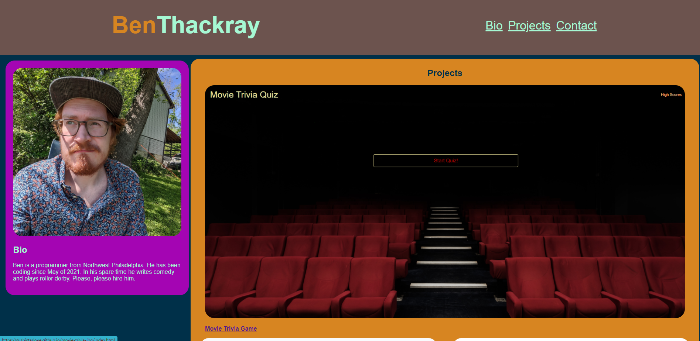

# Ben Thackray Portfolio
Professional Portfolio for Ben Thackray (in progress)

##Description
This project was to create a professional portfolio for employers to view and to showcase my own work. It required me to use the skills I have learned with CSS including flexboxes.  The requirements were to have a name, a photo, my work, contact information and links to the different sections. It also had to be able to size appropriately when viewed on smaller or mobile screens.

I organized the sections into three boxes, putting the bio to the left, the projects to the right, and the contacts below.  

UPDATED: I now have links to three of my projects, my github profile, my linkedin profile and my resume

## Installation

Links

-[Portfolio](https://benthackray.github.io/benthackrayportfolio/)
-[Git repo](https://github.com/benthackray/benthackrayportfolio)

## Usage
n\a

## Credits
Color Scheme picked with [Coolors](https://coolors.co/)

## License
Fair Use